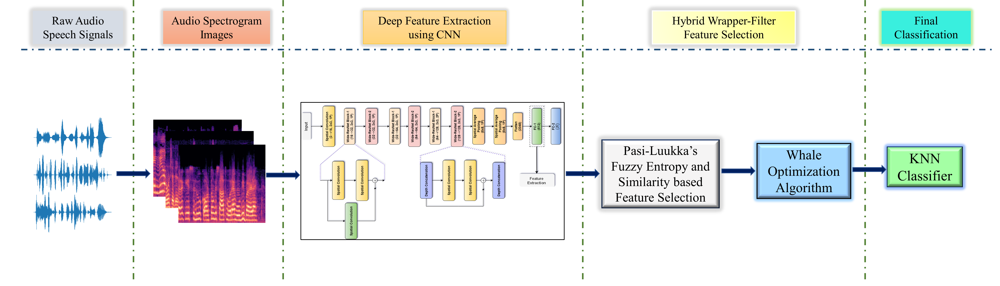

# Wrapper-Filter-Speech-Emotion-Recognition
Based on our paper [**"A Hybrid Deep Feature Selection Framework for Emotion Recognition from Human Speeches"**](https://link.springer.com/article/10.1007/s11042-022-14052-y) published in _Multimedia Tools and Applications_, Springer.

## Overall Workflow


# Requirements
To install the required dependencies run the following in command prompt:
`pip install -r requirements.txt`

# Running the codes:
Required directory structure: (**"data"** directory contains class-wise **spectrograms** of the raw audio files in original dataset).

```

+-- data
|   +-- .
|   +-- train
|   +-- val
+-- PasiLuukka.py
+-- WOA_FS.py
+-- __init__.py
+-- audio2spectrogram.py
+-- main.py
+-- model.py

```
Then, run the code using the command prompt as follows:

`python main.py --data_dir "./data"`

**Available arguments:**
- `--num_epochs`: number of training epochs. Default = 100
- `--learning_rate`: learning rate for training. Default = 0.0005
- `--batch_size`: batch size for training. Default = 4
- `--optimizer`: optimizer for training: SGD / Adam. Default = "SGD"

## Citation
If you find our paper useful for your research, consider citing us:
```
@article{marik2022hybrid,
  title={A hybrid deep feature selection framework for emotion recognition from human speeches},
  author={Marik, Aritra and Chattopadhyay, Soumitri and Singh, Pawan Kumar},
  journal={Multimedia Tools and Applications},
  DOI={https://doi.org/10.1007/s11042-022-14052-y},
  pages={1--27},
  year={2022},
  publisher={Springer}
}
```
